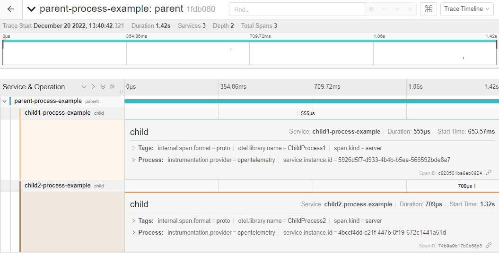

# .NET Context Propagation Across Processes

This example shows 2 ways to propagate context to sub processes using [Process.Start](https://learn.microsoft.com/en-us/dotnet/api/system.diagnostics.process.start?view=netframework-4.6.2).

1. ChildProcess1 - Context is propagated using process arguments.
1. ChildProcess2 - Context is propagated using environment variables.

